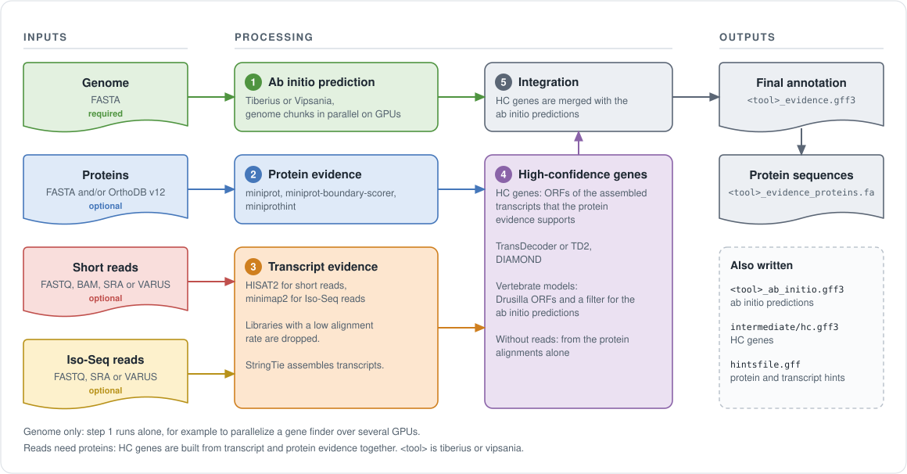
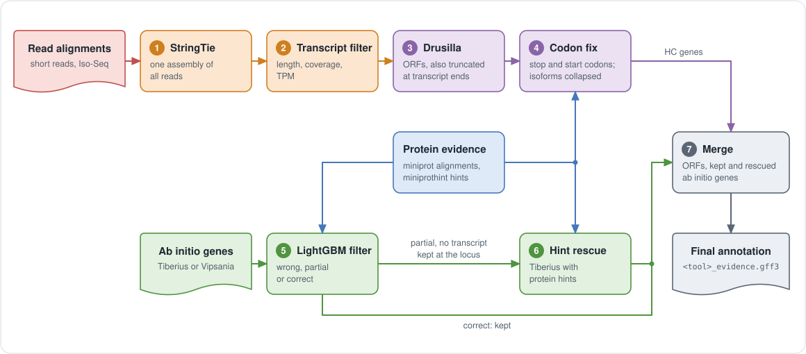

# Paludamentum

The paludamentum was the cloak worn by Roman emperors and commanders. This
repository is the cloak around the emperors of the
[Gaius-Augustus](https://github.com/Gaius-Augustus) gene finder family: a
Nextflow pipeline that prepares extrinsic evidence (proteins, RNA-Seq,
Iso-Seq), derives high-confidence genes from it, and integrates them with the
*ab initio* predictions of a deep learning gene finder.

The gene finders are git submodules of this repository. Paludamentum runs
them; they do not depend on Paludamentum.

| Submodule | Role | Status |
| --- | --- | --- |
| [Tiberius](https://github.com/Gaius-Augustus/Tiberius) (`tiberius/`) | gene finder | supported |
| [Vipsania](https://github.com/Gaius-Augustus/Vipsania) (`vipsania/`) | gene finder | supported, see [docs/vipsania.md](docs/vipsania.md) |
| [Drusilla](https://github.com/Gaius-Augustus/Drusilla) (`drusilla/`) | ORF annotator for assembled transcripts | high-confidence genes for vertebrate models, see [Drusilla flow](#drusilla-flow) |

> **Status (v0.4.0).** Paludamentum is the entry point: `paludamentum`
> launches the pipeline with Tiberius or Vipsania. Earlier versions were a
> submodule of Tiberius and were launched by `tiberius.py`; that direction is
> reversed since v0.3.0. v0.4.0 adds the [Drusilla flow](#drusilla-flow) for
> vertebrate models.

## Table of contents

- [What the pipeline does](#what-the-pipeline-does)
- [Installation](#installation)
- [Requirements](#requirements)
- [Quick start](#quick-start)
- [Inputs and modes](#inputs-and-modes)
- [Outputs](#outputs)
- [Gene finders](#gene-finders)
- [Drusilla flow](#drusilla-flow)
- [Containers and HPC](#containers-and-hpc)
- [Documentation](#documentation)
- [License and citation](#license-and-citation)
- [Funding](#funding)

## What the pipeline does

<p align="center">
  
</p>

The numbers in the figure are the steps below.

1. **_Ab initio_ prediction.** The genome is split into chunks, the gene finder
   runs on each chunk on a GPU, and the chunk predictions are merged.
2. **Protein evidence.** Proteins (your FASTA files and/or OrthoDB v12
   partitions) are aligned with miniprot, scored with
   miniprot-boundary-scorer, and converted to hints with miniprothint. For
   very large protein databases the *ab initio* proteins are used to select the
   most relevant source species first (DIAMOND).
3. **Transcript evidence.** Short reads are aligned with HISAT2, Iso-Seq reads
   with minimap2. Libraries with a low alignment rate are dropped. Transcripts
   are assembled with StringTie, and intron hints are extracted.
4. **High-confidence genes.** Assembled transcripts get ORFs from TransDecoder.
   ORFs that are supported by protein homology (DIAMOND) and by the scored
   protein alignments become the high-confidence (HC) gene set. TD2 can
   replace TransDecoder (`transdecoder: td2`); a comparison is in
   [docs/orf_finder_comparison.md](docs/orf_finder_comparison.md).
5. **Integration.** The HC genes are merged with the *ab initio* predictions into
   the final annotation, and its protein sequences are extracted.

For vertebrate gene finder models, runs with transcripts use the
[Drusilla flow](#drusilla-flow) in steps 4 and 5 instead.

Without any evidence input the pipeline runs step 1 only. That is useful to
parallelize a gene finder over several GPUs.

## Installation

```bash
git clone --recursive https://github.com/Gaius-Augustus/Paludamentum
cd Paludamentum
pip install -e .
```

`--recursive` checks out the submodules `tiberius/`, `vipsania/` and
`drusilla/`. In an existing clone run `git submodule update --init` after
`git pull`. `pip install -e .` installs the launcher (`paludamentum`, also
`python -m paludamentum`) linked to the checkout; the pipeline (`main.nf`,
`conf/`, `bin/`) runs from the checkout. If you install without `-e`, or
move the checkout, point the launcher at it with
`export PALUDAMENTUM_ROOT=/path/to/Paludamentum`.

The pipeline runs the gene finders and all tools in containers, so the
submodules do not have to be installed. The Tiberius checkout is used to
resolve model configuration names (`--model_cfg diatoms`) and, for runs
without containers, to find `tiberius.py`.

## Requirements

On the machine that launches the pipeline:

- Nextflow 25.04 or newer
- Java 17 or newer (required by Nextflow)
- Singularity or Apptainer (all tools run in containers, see [docs/containers.md](docs/containers.md))
- Python 3.9 or newer with `pyyaml`
- an NVIDIA GPU on the nodes that run the gene finder step, up to and
  including the Blackwell generation (for example RTX PRO 6000)

You do not need to install HISAT2, miniprot, StringTie and the other tools
when you use the containers. To run without containers, all tools must be in
your `PATH`, or be configured under `tools:` in the params file, and the gene
finder must be installed (`pip install ./vipsania`; Tiberius runs from the
checkout). The launcher option `--check_tools` verifies this.

## Quick start

```bash
# Tiberius, ab initio only, parallelized over GPUs by Nextflow
paludamentum --nf_config slurm_generic --genome genome.fa --model_cfg eudicotyledons

# Tiberius with evidence, inputs from a params file
paludamentum --params_yaml params.yaml --nf_config slurm_generic

# Vipsania with evidence, inputs on the command line
paludamentum --genefinder vipsania --nf_config local --genome genome.fa --model Fungi \
    --proteins proteins.faa --rnaseq_paired "/abs/path/rnaseq/*_{1,2}.fastq.gz"
```

`--nf_config` takes a path or the name of a config in `conf/`
(`local`, `slurm_generic`, ...); `local` sizes the tasks to the machine it
runs on, `slurm_generic` needs your GPU partition (see
[Containers and HPC](#containers-and-hpc)). Evidence can be given on the command line
(`--proteins`, `--odb12Partitions`, `--rnaseq_paired`, `--rnaseq_single`,
`--isoseq`, `--rnaseq_sra_paired`, `--rnaseq_sra_single`, `--isoseq_sra`) or
in the params file; command line values override the file. Useful options:
`--dry_run` writes the params file and validates inputs and executables
without starting Nextflow, `--resume` continues a previous run, `--work_dir`
sets the Nextflow work directory. Arguments after `--` go to Nextflow.
`paludamentum --help` lists everything.

### Params file

Start from [conf/parameters.yaml](conf/parameters.yaml). Minimal example:

```yaml
genome: /abs/path/genome.fa
proteins: /abs/path/proteins.faa
rnaseq_paired: "/abs/path/rnaseq/*_{1,2}.fastq.gz"
outdir: results
tiberius:
  run: true
  model_cfg: eudicotyledons
```

The launcher expands `~` and environment variables and resolves relative
paths against the launch directory, not against the params file; it writes
the merged parameters of a run with absolute paths to `<outdir>/params.yaml`.
Paths must not contain spaces. All parameters are documented in
[docs/parameters.md](docs/parameters.md).

## Inputs and modes

| Parameter | Content |
| --- | --- |
| `genome` | genome FASTA, optionally gzipped (required) |
| `proteins` | one protein FASTA or a list; lists are concatenated |
| `odb12Partitions` | OrthoDB v12 partitions to download: `Metazoa`, `Vertebrata`, `Viridiplantae`, `Arthropoda`, `Fungi`, `Alveolata`, `Stramenopiles`, `Amoebozoa`, `Euglenozoa`, `Eukaryota` |
| `rnaseq_paired`, `rnaseq_single` | short read FASTQ files (glob or list) |
| `rnaseq_bam` | aligned short reads, for example from VARUS |
| `isoseq` | Iso-Seq FASTQ files |
| `rnaseq_sra_paired`, `rnaseq_sra_single`, `isoseq_sra` | SRA run accessions, downloaded by the pipeline |
| `min_alignment_rate` | libraries whose alignment rate (percent mapped) is below this value are dropped; default 80 |

The mode is inferred from the inputs and can be forced with `mode`
(`--mode`). A forced mode without its inputs, or transcript evidence without
proteins, is an error:

| Mode | Inputs |
| --- | --- |
| `abinitio` (historic name: `tiberius`) | genome only |
| `proteins` | proteins |
| `rnaseq` | proteins and short reads |
| `isoseq` | proteins and Iso-Seq |
| `mixed` | proteins, short reads and Iso-Seq |

Transcript evidence requires protein evidence, because HC genes need both.

## Outputs

All files are written to `outdir` (default `<genefinder>_results`). `<tool>`
is `tiberius` or `vipsania`.

| File | Content |
| --- | --- |
| `<tool>_evidence.gff3` | final annotation: *ab initio* predictions merged with HC genes |
| `<tool>_evidence_proteins.fa` | protein sequences of the final annotation |
| `<tool>_ab_initio.gff3` | *ab initio* predictions (in `intermediate/` when evidence is used) |
| `intermediate/hc.gff3` | high-confidence genes derived from the evidence (TransDecoder) |
| `intermediate/drusilla_orfs.gtf` | Drusilla ORFs, the HC genes of the Drusilla flow |
| `intermediate/<tool>_lgb_filtered.gtf` | *ab initio* predictions kept by the LightGBM filter (Drusilla flow) |
| `intermediate/<tool>_lgb_scores.tsv` | LightGBM class probabilities of all *ab initio* transcripts (Drusilla flow) |
| `intermediate/hint_rescue.gtf` | *ab initio* genes predicted again with protein hints (Drusilla flow; missing if the rescue was skipped) |
| `hintsfile.gff` | protein, RNA-Seq and Iso-Seq hints |
| `sra_downloads/` | reads downloaded from SRA |
| `params.yaml` | the merged parameters of this run, written by the launcher |

Nextflow's timeline, trace and report files are written as well.

## Gene finders

`--genefinder tiberius|vipsania` selects the gene finder. Without it, the
launcher takes `genefinder` from the params file, else the block with
`run: true`, else Vipsania if `--model` is given, else Tiberius. Only one
gene finder runs per pipeline run.

| Gene finder | Model | Parameters |
| --- | --- | --- |
| Tiberius | `--model_cfg`, a name in `tiberius/model_cfg` of the submodule (for example `eudicotyledons`) or a path | [docs/parameters.md](docs/parameters.md#gene-finder-tiberius) |
| Vipsania | `--model`, a clade name (for example `Fungi`) or a model id | [docs/vipsania.md](docs/vipsania.md) |

Model weights are downloaded once on the submitting host, so the GPU nodes
need no internet; `model_dir` takes weights that you downloaded yourself.
Vipsania finetuning on the target genome is off by default (`--finetune`).

## Drusilla flow

For vertebrate gene finder models, runs with transcripts take another route
through steps 4 and 5: Drusilla ORFs replace the TransDecoder HC genes, a
LightGBM model filters the *ab initio* predictions, and Tiberius predicts
partial genes again with protein hints. With the Tiberius `vertebrates`
model, the gene-level F1 is 80.36 on *Takifugu rubripes* and 79.46 on
*Bos taurus*. The flow is switched on automatically (`drusilla.run: auto`).
Conditions, steps, parameters and known issues are in
[docs/drusilla_flow.md](docs/drusilla_flow.md).

<p align="center">
  
</p>

## Containers and HPC

All tools and gene finders run in Singularity/Apptainer images that are
pinned in [conf/base.config](conf/base.config) and pulled once into
`~/.cache/paludamentum/singularity` (each gene finder image is about 9.4 GB,
the evidence image 0.25 GB). The images are listed in
[docs/containers.md](docs/containers.md).

`--nf_config` takes a path or the name of a config in `conf/`:
`local` runs everything on one machine, `slurm_generic` is a starting point
for SLURM. For your own cluster, copy
[conf/user_hpc_template.config](conf/user_hpc_template.config) and set your
queues, GPU options and scratch paths, see [docs/hpc.md](docs/hpc.md).
Downloads (SRA reads, OrthoDB partitions, model weights) run on the
submitting host, which needs internet access.

## Documentation

| Page | Content |
| --- | --- |
| [docs/parameters.md](docs/parameters.md) | all parameters: inputs, gene finder blocks, Drusilla flow, mode |
| [docs/vipsania.md](docs/vipsania.md) | Vipsania as gene finder: models, finetuning, offline nodes |
| [docs/drusilla_flow.md](docs/drusilla_flow.md) | Drusilla flow for vertebrate models: conditions, steps, known issues |
| [docs/containers.md](docs/containers.md) | container images and how they are pinned |
| [docs/hpc.md](docs/hpc.md) | Nextflow config for your cluster, process labels |
| [docs/orf_finder_comparison.md](docs/orf_finder_comparison.md) | TransDecoder, TD2 and Drusilla as ORF finder of the HC gene step |
| [docs/hint_rescue_comparison.md](docs/hint_rescue_comparison.md) | hint rescue compared with the original scripts |
| [docs/development.md](docs/development.md) | repository layout, notes for maintainers, testing, roadmap |

## License and citation

Artistic License 1.0, see [LICENSE](LICENSE). Scripts in `bin/` copied from
Tiberius say so in their header and stay under its MIT License, see
[LICENSE-Tiberius](LICENSE-Tiberius).

If you use the pipeline, cite the gene finder you ran and this repository
([CITATION.cff](CITATION.cff)). The references are in
the READMEs of [Tiberius](https://github.com/Gaius-Augustus/Tiberius) and
[Vipsania](https://github.com/Gaius-Augustus/Vipsania). Please also cite the
tools that the pipeline runs on your data: miniprot, miniprot-boundary-scorer,
miniprothint, HISAT2, minimap2, StringTie, TransDecoder, DIAMOND, SAMtools,
BEDTools, gffread, and AUGUSTUS (bam2hints).

If the [Drusilla flow](#drusilla-flow) ran, please also cite:

- the poster the flow and its LightGBM filter are derived from. The hint
  rescue is not on the poster and is not published yet; it is Lars Gabriel's
  work (tiberius_orf_finder scripts, Tiberius branch `hint_integration`).
  Gabriel L, Hoff KJ. Annotating Eukaryotic Genomes by Combining Deep Learning
  with extrinsic evidence. Poster, GCB 2026.
  [doi:10.13140/RG.2.2.24444.91521](https://doi.org/10.13140/RG.2.2.24444.91521)
- [Drusilla](https://github.com/Gaius-Augustus/Drusilla) (repository; there is
  no publication yet)
- LightGBM: Ke G, Meng Q, Finley T, Wang T, Chen W, Ma W, Ye Q, Liu T-Y.
  LightGBM: A Highly Efficient Gradient Boosting Decision Tree. Advances in
  Neural Information Processing Systems 30 (NIPS 2017).
  [proceedings](https://proceedings.neurips.cc/paper_files/paper/2017/hash/6449f44a102fde848669bdd9eb6b76fa-Abstract.html)
- Tiberius, also when Vipsania is the gene finder, because the hint rescue
  runs Tiberius

## Funding

Funded by the Deutsche Forschungsgemeinschaft (DFG, German Research
Foundation), project number 552910312: "AI-GUSTUS: Eine cloud-native Pipeline
für genaue Genom-Annotation" (AI-GUSTUS: a cloud-native pipeline for accurate
genome annotation).
